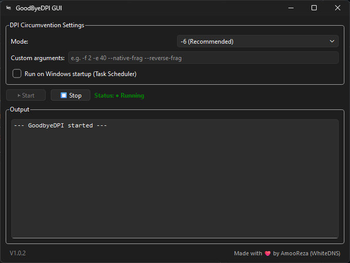

# GoodByeDPI GUI

A clean and simple graphical interface for [GoodbyeDPI](https://github.com/ValdikSS/GoodbyeDPI) — the tool that bypasses Deep Packet Inspection (DPI) and unblocks websites.

No command lines, no manual configuration. Just click and browse.

---

## ✨ Features

- 🖥 **Fully graphical** – no terminal needed
- ⚡ **One‑click start/stop** with recommended presets (`-6` mode)
- 🔧 **Custom arguments** for advanced users
- 🚀 **Run on Windows startup** (via Task Scheduler)
- 📋 **Real‑time output** so you can see what’s happening
- 📦 **Single portable EXE** – everything is bundled inside, no installation required
- 🛡 **Zero impact** on games, streaming or other traffic

---

## 📸 Screenshots

---

## 🔽 How to use (EXE version)

1. **Download the latest `GoodByeDPI GUI.exe`** from the [Releases page](https://github.com/ZvanTors/GoodbyeDPI-GUI/releases).
2. **Run the EXE** – Windows will ask for administrator permission (required to modify network packets). Accept it.
3. **Choose a mode:**
   - `-6 (Recommended)` – works for most ISPs. Uses reverse fragmentation and fake sequence numbers.
   - `-5 (General)` – a gentler fragmentation preset.
   - `Custom` – enter your own GoodbyeDPI arguments.
4. Click **▶ Start**.
5. Open your browser and visit the website that was previously blocked. It should load instantly.
6. When you are done, click **⏹ Stop** to turn off the circumvention.

**Optional:** Check the *“Run on Windows startup”* option to have GoodbyeDPI automatically start when you log in.

---

## ⚠️ Important notes

- **Administrator rights are mandatory** – the tool manipulates outgoing TCP packets.
- Some antivirus programs may flag `WinDivert.dll` (false positive). Add an exception if necessary.
- The tool **does not** slow down your internet or affect online games – it only tweaks the very first packet of each connection.
- If the `-6` mode does not work for you, try `-5` or experiment with custom settings. Refer to the [official GoodbyeDPI documentation](https://github.com/ValdikSS/GoodbyeDPI#command-line-options) for more arguments.

---

## 📄 License

This project is provided under the MIT License – see the [LICENSE](LICENSE) file for details.