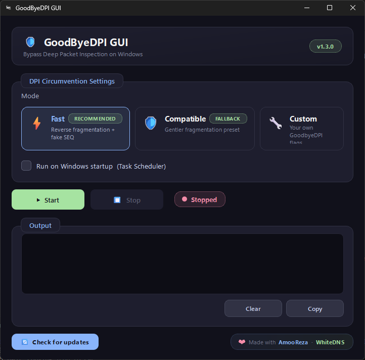

<h1>🚀 GoodByeDPI GUI</h1>

<strong>A clean, powerful graphical interface for <a href="https://github.com/ValdikSS/GoodbyeDPI">GoodbyeDPI</a> — bypass Deep Packet Inspection (DPI) and browse freely.</strong>

<em>No command lines. No configuration files. Just click and browse.</em>

 

 

---

<h2>📖 Table of Contents</h2>

<ul>
  <li><a href="#-about">🌟 About</a></li>
  <li><a href="#-features">✨ Features</a></li>
  <li><a href="#-how-to-use">🔽 How to Use</a></li>
  <li><a href="#-building-from-source">🛠 Building from Source</a></li>
  <li><a href="#-project-structure">🏗 Project Structure</a></li>
  <li><a href="#-troubleshooting">🩺 Troubleshooting</a></li>
  <li><a href="#-faq">❓ FAQ</a></li>
  <li><a href="#-contributing">🤝 Contributing</a></li>
  <li><a href="#-license">📄 License</a></li>
  <li><a href="#-support">💝 Support the Project</a></li>
  <li><a href="#-credits">💖 Credits</a></li>
</ul>

---

<h2 id="-about">🌟 About</h2>

<strong>GoodByeDPI GUI</strong> wraps the powerful <a href="https://github.com/ValdikSS/GoodbyeDPI">GoodbyeDPI</a> command-line tool in a modern, easy-to-use desktop application for Windows.

If your ISP blocks websites using <strong>Deep Packet Inspection (DPI)</strong>, this tool helps you bypass it — just like a VPN, but lightweight, local, and free.

<blockquote>

💡 <strong>Best part:</strong> it doesn’t slow down your connection, doesn’t affect games, and runs entirely on your machine. No servers, no logs, no subscriptions.

</blockquote>

---

<h2 id="-features">✨ Features</h2>

<table>
  <thead>
    <tr>
      <th>Feature</th>
      <th>Description</th>
    </tr>
  </thead>
  <tbody>
    <tr><td>🖥 <strong>Fully Graphical</strong></td><td>No terminal, no scripts — a clean PySide6 GUI</td></tr>
    <tr><td>⚡ <strong>One-Click Start / Stop</strong></td><td>Activate or deactivate DPI circumvention instantly</td></tr>
    <tr><td>🎛 <strong>Preset Modes</strong></td><td>Choose between <em>Fast</em> (recommended), <em>Compatible</em>, or <em>Custom</em></td></tr>
    <tr><td>🔧 <strong>Custom Arguments</strong></td><td>Advanced users can pass any GoodbyeDPI flags</td></tr>
    <tr><td>🚀 <strong>Auto-Start with Windows</strong></td><td>Optional Task Scheduler integration</td></tr>
    <tr><td>📋 <strong>Live Output Log</strong></td><td>See exactly what’s happening in real time</td></tr>
    <tr><td>📦 <strong>Single Portable EXE</strong></td><td>Everything bundled — no installation, no dependencies</td></tr>
    <tr><td>🌐 <strong>Auto Update Checker</strong></td><td>Notifies you when a new version is available with a direct download link</td></tr>
    <tr><td>🛡 <strong>Zero Impact</strong></td><td>Doesn’t affect games, streaming, or general traffic</td></tr>
    <tr><td>🔔 <strong>System Tray Support</strong></td><td>Runs quietly in the background with Start / Stop / Exit controls</td></tr>
    <tr><td>🎨 <strong>Modern Dark UI</strong></td><td>Catppuccin-inspired theme with rounded cards and dark title bar</td></tr>
    <tr><td>💾 <strong>Persistent Settings</strong></td><td>Window position, mode, and custom arguments remembered between sessions</td></tr>
  </tbody>
</table>

---

<h2 id="-how-to-use">🔽 How to Use</h2>

<h3>1️⃣ Download</h3>

Grab the latest <strong><code>GoodByeDPI.GUI.exe</code></strong> from the <a href="https://github.com/ZvanTors/GoodByeDPI-GUI/releases/latest">Releases page</a>.

<h3>2️⃣ Run</h3>

Double-click the EXE. Windows will request <strong>administrator privileges</strong> — accept it (required to modify network packets).

<h3>3️⃣ Choose a Mode</h3>

<table>
  <thead>
    <tr>
      <th>Mode</th>
      <th>Description</th>
    </tr>
  </thead>
  <tbody>
    <tr><td><code>Fast — Recommended</code></td><td>Best for most ISPs — reverse fragmentation + fake SEQ (<code>-6</code>)</td></tr>
    <tr><td><code>Compatible — Fallback</code></td><td>Gentler fragmentation preset (<code>-5</code>)</td></tr>
    <tr><td><code>Custom arguments</code></td><td>Enter your own GoodbyeDPI arguments manually</td></tr>
  </tbody>
</table>

<h3>4️⃣ Activate</h3>

Click <strong>▶ Start</strong>.

<h3>5️⃣ Browse</h3>

Open your browser and visit any previously blocked site — it should now load instantly. ✅

<h3>6️⃣ Stop (Optional)</h3>

Click <strong>⏹ Stop</strong> when you no longer need the bypass.

<blockquote>

<strong>Tip:</strong> Enable <strong>“Run on Windows startup”</strong> to have GoodByeDPI launch automatically when you log in.

</blockquote>

<blockquote>

<strong>Tray:</strong> Closing the window asks whether to exit or minimize to the system tray. From the tray you can Start, Stop, or Exit at any time.

</blockquote>

---

<h2 id="-building-from-source">🛠 Building from Source</h2>

Want to build the EXE yourself? Follow these steps:

<h3>Prerequisites</h3>

<ul>
  <li><strong>Python 3.8+</strong></li>
  <li><strong>Windows 10 / 11 (64-bit)</strong></li>
</ul>

<h3>Steps</h3>

<strong>1. Clone the repository</strong>

<pre><code>git clone https://github.com/ZvanTors/GoodByeDPI-GUI.git
cd GoodByeDPI-GUI</code></pre>

<strong>2. Install dependencies</strong>

<pre><code>pip install pyside6 pyinstaller</code></pre>

<strong>3. Download GoodbyeDPI</strong> from the <a href="https://github.com/ValdikSS/GoodbyeDPI/releases">official releases</a> and place these files in the project folder:

<ul>
  <li><code>goodbyedpi.exe</code></li>
  <li><code>WinDivert.dll</code></li>
  <li><code>WinDivert64.sys</code></li>
</ul>

<strong>4. Add an icon</strong> (optional): place <code>logo.ico</code> in the project folder.

<strong>5. Build the EXE</strong>

<pre><code>pyinstaller --onefile --windowed --uac-admin --name "GoodByeDPI GUI" --add-data "goodbyedpi.exe;." --add-data "WinDivert.dll;." --add-data "WinDivert64.sys;." --add-data "logo.ico;." --icon=logo.ico main.py</code></pre>

<strong>6. Find your EXE</strong> in the <code>dist/</code> folder.

---

<h2 id="-project-structure">🏗 Project Structure</h2>

The codebase is split into focused modules for maintainability:

<pre><code>GoodByeDPI-GUI/
├── main.py           ← entry point
├── constants.py      ← app constants &amp; mode presets
├── utils.py          ← helpers (paths, admin check, version parse)
├── theme.py          ← Catppuccin-inspired QSS
├── settings.py       ← persistent settings (QSettings)
├── updater.py        ← GitHub release checker (background thread)
├── tray.py           ← system tray icon &amp; menu
├── ui.py             ← pure UI (signals only)
├── controller.py     ← wiring logic between UI and services
├── goodbyedpi.exe
├── WinDivert.dll
├── WinDivert64.sys
└── logo.ico</code></pre>

---

<h2 id="-troubleshooting">🩺 Troubleshooting</h2>

<strong>❌ The program won’t start / asks for admin again</strong>

Right-click the EXE → <strong>Run as administrator</strong>. The UAC prompt is expected.

<strong>❌ Antivirus flags <code>WinDivert.dll</code></strong>

This is a <strong>false positive</strong>. <code>WinDivert</code> is a legitimate library used by many network tools. Add the EXE (or the entire folder) to your antivirus exclusions.

<strong>❌ Websites still don’t open</strong>

<ul>
  <li>Try mode <code>Compatible</code> instead of <code>Fast</code>.</li>
  <li>Use <strong>Custom arguments</strong> mode with: <code>-f 2 -e 40 --native-frag --reverse-frag --max-payload</code></li>
  <li>Make sure <strong>no VPN</strong> is currently active.</li>
  <li>Your ISP may use a different filtering method — consider <strong>Cloudflare WARP</strong> as an alternative.</li>
</ul>

<strong>❌ Auto-start isn’t working</strong>

<ol>
  <li>Open <strong>Task Scheduler</strong> (<code>taskschd.msc</code>).</li>
  <li>Locate the task named <strong>GoodbyeDPIManager</strong>.</li>
  <li>Make sure <strong>“Run with highest privileges”</strong> is checked.</li>
  <li>If missing, uncheck and re-check the option in the GUI.</li>
</ol>

<strong>❌ Update dialog doesn’t appear</strong>

The update check runs silently in the background. If no popup appears, you’re either up to date or offline. You can trigger a manual check by clicking <strong>🔄 Check for updates</strong> in the bottom-left of the window.

---

<h2 id="-faq">❓ FAQ</h2>

<strong>Does this slow down my internet?</strong>

No. GoodbyeDPI only modifies the very first TLS packet of each connection. Your speed and ping stay the same.

<strong>Will it affect online games?</strong>

No. Games mostly use UDP, which GoodbyeDPI doesn't touch.

<strong>Is it legal?</strong>

This tool is provided for educational and personal use. Check your local laws.

<strong>Can I use it with a VPN?</strong>

Yes, but it's usually unnecessary. If the VPN already bypasses filtering, you can stop GoodByeDPI.

<strong>Does it work on Windows 7/8?</strong>

Only Windows 10 and 11 are officially supported.

---

<h2 id="-contributing">🤝 Contributing</h2>

Contributions, bug reports, and feature requests are welcome!

<ol>
  <li>Fork the repository</li>
  <li>Create a feature branch: <code>git checkout -b feature/amazing-feature</code></li>
  <li>Commit your changes: <code>git commit -m "Add amazing feature"</code></li>
  <li>Push to the branch: <code>git push origin feature/amazing-feature</code></li>
  <li>Open a <strong>Pull Request</strong></li>
</ol>

Please make sure your code follows the existing style and includes comments where necessary.

---

<h2 id="-license">📄 License</h2>

This project is licensed under the <strong>MIT License</strong> — see the <a href="LICENSE">LICENSE</a> file for details.

---

<h2 id="-support">💝 Support the Project</h2>

<strong>GoodByeDPI GUI</strong> is free, open source, and built with ❤️ in my spare time. 
If it helped you bypass censorship and browse freely, consider supporting its development. 
Every contribution — no matter how small — keeps the project alive and improving. 🙏

 

<table align="center">
  <thead>
    <tr>
      <th align="center">Network</th>
      <th align="center">Asset</th>
      <th align="left">Wallet Address</th>
    </tr>
  </thead>
  <tbody>
    <tr>
      <td align="center"></td>
      <td align="center"><strong>TRX</strong></td>
      <td><code>TWukNBmxLUbPVgayRsZ72u84K8yW7K9cQw</code></td>
    </tr>
    <tr>
      <td align="center"></td>
      <td align="center"><strong>USDT</strong></td>
      <td><code>TWukNBmxLUbPVgayRsZ72u84K8yW7K9cQw</code></td>
    </tr>
  </tbody>
</table>

 

<blockquote>

⚠️ <strong>Important:</strong> Only send <strong>TRX</strong> or <strong>USDT (TRC20)</strong> to this address. 
Sending any other asset or using a different network (ERC20, BEP20, etc.) will result in <strong>permanent loss of funds</strong>.

</blockquote>

 

<strong>Thank you for your support!</strong> 🌟 
<em>Every donation fuels late-night coding sessions and new features.</em>

---

<h2 id="-credits">💖 Credits</h2>

<ul>
  <li><strong><a href="https://github.com/ValdikSS/GoodbyeDPI">GoodbyeDPI</a></strong> by <a href="https://github.com/ValdikSS">ValdikSS</a> — the core circumvention engine.</li>
  <li><strong><a href="https://pypi.org/project/PySide6/">PySide6</a></strong> — the Qt bindings powering the GUI.</li>
  <li><strong><a href="https://www.reqrypt.org/windivert.html">WinDivert</a></strong> — the Windows packet interception library.</li>
  <li><strong>Made with ❤️ by <a href="https://github.com/ZvanTors">AmooReza (WhiteDNS)</a></strong></li>
</ul>

---

<h3>⭐ If this project helped you, please give it a star!</h3>

 

<strong>Happy browsing — without borders.</strong> 🌍

